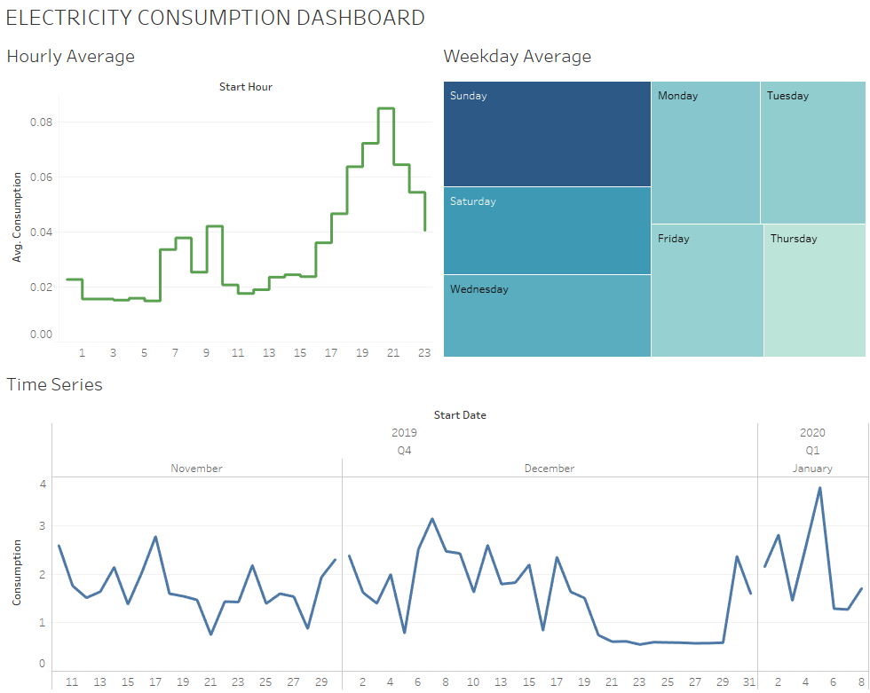

# energydash

My energy suppliers has an API supplying data every half an hour of my electricity consumption.
This script downloads some basic consumption data that can then be used in a dashboard. In this case the screenshot below is from Tableau.

